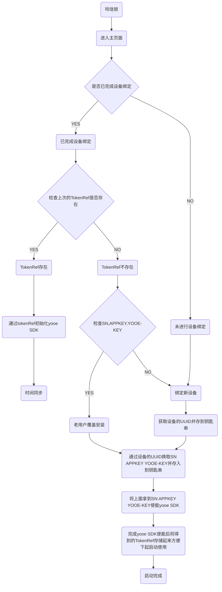

### 前言
由于后期版本需要移植玲珑密保锁的功能，目前玲珑密保锁的原开发团队产品流程图缺失，通过代码review从设备的SN码、TCP数据包协议、功能接口、yoo注意事项等方面进行梳理。

### SN码获取流程
首次安装，通过设备的UUID换取SN和APPKEY,初次得到的UUID、SN、APPKEY会被保存在钥匙串中，后面App重装也还能访问到，关于获取接口见后面`业务功能接口说明`。

### TCP传输中的包结构
#### 一个包分为包头和包体 
包头：占4个字节，存储包体的长度
包体：真实数据（String类型）的字节
```
+------------+-----------------+
|  Length    |  Actual Content |
|  0x000c    |  "Hello,world"  |
+------------+-----------------+
```
#### 涉及到的业务场景
sign签名规则：数据参数排序后拼接(常用的get请求参数拼接方式)，然后md5签名
```js
// 1. app上线，数据结构如下：
{
  "type": 21,
  "sn": 9959104511900,
  "remark":null,
  "created":1487917466889,
  "sign": "F3A615230CE4A7D277591C8727FF4945"
}

// 2. 服务端发来的心跳包，数据结构如下（目前发现app端没有对此类消息处理）：
{
  "type": 24,
  "code": 51,
  "message": "TCP在线状态"
}

// 3.APP定时发送心跳包，数据结构如下（iOS端时间间隔60，另一个定时器没3秒检查一次连接状态）：
{
  "type" : 4,
  "created" : 1488184042801
}

// 4.Tcp server推送解锁请求给app
{
  "type": 22,
  "requestId": 11113545443,
  "serverNo": 11113545443,
  "account": "test8888",
  "roleName": "张三",
  "group": "一区",
  "unlockType": 2,
  "unlockFlag": 0,
  "requestIP": "127.0.0.1",
  "sn": "11232454657",
  "remark": "备注",
  "created": 1488184042801,
  "sign":"C52466F9FB0F272D83002C54E9631247"
}
```
### YOO-E 六位动态码生成
yoo-e六位动态码的生成使用的是yoo-e提供的SDK离线算法，使用该SDK需要一定的前提条件：SN码，yooe-key。
```c++
//1.通过设备的UUID换取SN、APPKEY、YOOEKEY。

//2.通过1拿到的YOOEKEY是一个字符串，需要转化成16进制数据（这里需要特别注意）。

//3.然后将拿到的SN，转化后的yooe-key使能SDK服务。如：
AuthToken *authToken = [AuthToken newToken:@"Security" withSN:[NSString stringWithFormat:@"%@",SN] withAppName:@"Security" withKey:authKey withTimeSlice:30];

//4.使能服务后需要进行时间矫正，否则客户端与服务端的6位动态码生成不一致。
[authToken getNetTimeAndFix:^(NSError *error) {
    NSLog(@"after time fix...");
    int left = 0;
    NSString *otpStr = [authToken genOTPWithLeftSeconds:&left];
    NSLog(@"lironghua-otpStr:%@",otpStr);
}];

//5.执行矫正完成后，就可以调用genOTPWithLeftSeconds来生成6位动态码了
int left = 0;
NSString *otpStr = [authToken genOTPWithLeftSeconds:&left];

```
### 业务功能说明
#### 1.玲珑密保锁首页
该部分主要是6位动态码的实时更新，需要特别说明的是：该6位动态码与用户账号并无关系，直到用户完成账号绑定。以下进行该流程的梳理

